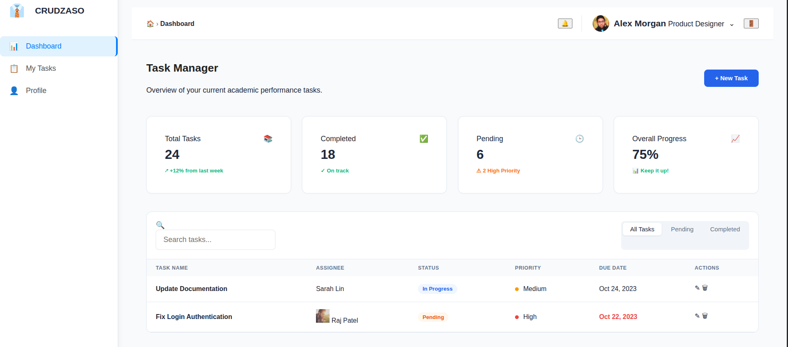

<div align="center">

# 👔 CRUDZASO

### Task Management, Reinvented.

**A modern, full-stack task management platform — sleek SPA frontend powered by Vite, backed by Express + Supabase.**

[](https://vitejs.dev)
[](https://expressjs.com)
[](https://supabase.com)
[](https://nodejs.org)
[](https://developer.mozilla.org/en-US/docs/Web/JavaScript)
[]()


---

**🔗 Live Demo** — _Coming soon_ &nbsp;·&nbsp; **📖 API Docs** → [`backend/README.md`](backend/README.md) &nbsp;·&nbsp; **🎨 Frontend Guide** → [`frontend/README.md`](frontend/README.md)

</div>

---

## 🚀 Why CRUDZASO?

Most task managers are either **too complex** or **too limited**. CRUDZASO strikes the perfect balance:

| For You | What You Get |
|---------|-------------|
| **👩‍💻 Developers** | A clean, modular codebase — Vanilla JS SPA + Express REST API + Supabase PostgreSQL. Easy to extend, easy to deploy. |
| **📋 Teams** | Create, track, and manage tasks with priority levels, statuses, and deadlines. Real-time dashboard with progress metrics. |
| **🎓 Educators & Students** | Perfect for academic project management, assignment tracking, and coursework organisation. |
| **🏢 Small Businesses** | Lightweight enough for daily operations, powerful enough for project oversight. |

---

## ✨ Features

<div align="center">

| | Feature | Description |
|:-:|---------|-------------|
| 📊 | **Smart Dashboard** | At-a-glance overview with total tasks, completion rate, pending items, and progress percentage |
| ✅ | **Full CRUD Tasks** | Create, read, update, and delete tasks with a clean, intuitive interface |
| 🏷️ | **Priority Levels** | Mark tasks as Low, Medium, or High priority with colour-coded indicators |
| 🔄 | **Status Tracking** | Track workflow stages: Pending → In Progress → Completed |
| 📅 | **Due Date Management** | Set and visualise deadlines for every task |
| 🔍 | **Search & Filter** | Quickly find tasks with search and category/status filters |
| 👤 | **User Profile** | Personal profile page with role, department, and task summary |
| 🔐 | **Authentication** | Login system (extensible to JWT-based auth) |
| 📱 | **Responsive Layout** | Sidebar navigation + main content area, ready for mobile adaptation |
| ⚡ | **Blazing Fast SPA** | Zero page reloads — client-side routing powered by native History API |

</div>

---

## 🖥️ Demo

<div align="center">
  <td>
    
  </td>
</div>

---

## 🧱 Architecture at a Glance

```
┌──────────────────────────────────────────────────┐
│                    CLIENT                         │
│  ┌────────────────────────────────────────────┐  │
│  │           Vite Dev Server :5173            │  │
│  │  ┌──────────┐  ┌──────────┐  ┌─────────┐  │  │
│  │  │   SPA    │  │  Layout  │  │  Pages  │  │  │
│  │  │  Router  │  │ Component│  │ Home,   │  │  │
│  │  │          │  │          │  │ Task,   │  │  │
│  │  │          │  │          │  │ Profile │  │  │
│  │  └──────────┘  └──────────┘  └─────────┘  │  │
│  │  ┌────────────────────────────────────────┐ │  │
│  │  │        API Helper (fetch wrapper)      │ │  │
│  │  └────────────────────────────────────────┘ │  │
│  └────────────────────────────────────────────┘  │
└──────────────────────┬───────────────────────────┘
                       │  HTTP (JSON)
                       ▼
┌──────────────────────────────────────────────────┐
│                    SERVER                         │
│  ┌────────────────────────────────────────────┐  │
│  │      Express REST API :3000                │  │
│  │  ┌──────────┐  ┌──────────┐  ┌─────────┐  │  │
│  │  │  Routes  │→ │   CRUD   │→ │Supabase │  │  │
│  │  │  /tasks  │  │Controller│  │ Client  │  │  │
│  │  └──────────┘  └──────────┘  └─────────┘  │  │
│  └────────────────────────────────────────────┘  │
└──────────────────────┬───────────────────────────┘
                       │  SQL
                       ▼
              ┌──────────────────┐
              │    Supabase      │
              │   (PostgreSQL)   │
              │   ┌──────────┐   │
              │   │  tasks   │   │
              │   │  table   │   │
              │   └──────────┘   │
              └──────────────────┘
```

### Tech Stack Breakdown

```
Frontend         Backend          Database
─────────        ───────          ────────
Vite 7           Express 4        Supabase
Vanilla JS       Node.js 18+      PostgreSQL
CSS3             CORS             Row-Level Security
ES Modules       dotenv           Realtime (optional)
json-server      Supabase JS      Auto-generated API
(mock API)       ws (WebSocket)
```

---

## ⚡ Quick Start (3 minutes)

```bash
# 1. Get the code
git clone https://github.com/Estivendelgado16/pruebaM3.git
cd pruebaM3

# 2. Install frontend dependencies
cd frontend && npm install && cd ..

# 3. Backend setup
cd backend
npm init -y
npm install express cors dotenv @supabase/supabase-js ws
cp .env.example .env
# ✏️ Edit .env with your Supabase credentials
cd ..

# 4. Launch both servers
# Terminal 1 — Backend API
cd backend && npm start

# Terminal 2 — Frontend SPA
cd frontend && npm run dev
```

Then open **[http://localhost:5173](http://localhost:5173)** in your browser.

> **Login credentials:** `admin` / `1234`

---

## 🗺️ Project Map

```
pruebaM3/
├── frontend/              # 🎨 Vite SPA (Vanilla JS)
│   ├── src/
│   │   ├── pages/        # Dashboard, Tasks, Profile, Login
│   │   ├── components/   # Reusable Layout & ToDo form
│   │   ├── routes/       # Client-side SPA router
│   │   └── utils/        # API helper (fetch wrapper)
│   └── package.json
│
├── backend/               # ⚙️ Express REST API
│   ├── server.js         # Entry point
│   ├── routes/           # /tasks endpoints
│   ├── controllers/      # CRUD logic
│   ├── config/           # Supabase client
│   └── .env.example
│
├── db.json               # 📁 Mock data (json-server)
└── README.md             # 📘 You are here
```

📖 **Detailed documentation:**
- [Frontend README](frontend/README.md) — Components, routing, API helper, environment variables
- [Backend README](backend/README.md) — API reference, Supabase setup, error handling

---

## 📊 API Endpoints

| Method | Endpoint | Description | 
|--------|----------|-------------|
| 🟢 `GET` | `/` | Health check |
| 🟢 `GET` | `/tasks` | List all tasks |
| 🟡 `POST` | `/tasks` | Create a new task |
| 🔵 `PUT` | `/tasks/:id` | Update a task |
| 🔴 `DELETE` | `/tasks/:id` | Delete a task |

---

## 🧪 Try It Yourself

```bash
# List all tasks
curl http://localhost:3000/tasks

# Create a task
curl -X POST http://localhost:3000/tasks \
  -H "Content-Type: application/json" \
  -d '{"task":"Build something amazing","priority":"high","status":"pending"}'

# Health check
curl http://localhost:3000
```

---

## 🛣️ Roadmap

- [ ] **🔐 JWT Authentication** — Secure login with token-based sessions
- [ ] **📱 Mobile Responsive** — Full mobile-first layout
- [ ] **🌐 i18n Support** — Multi-language interface
- [ ] **📊 Advanced Analytics** — Charts, trends, productivity insights
- [ ] **🔔 Real-time Updates** — Supabase Realtime for live task changes
- [ ] **🧩 Drag & Drop** — Kanban-style board view
- [ ] **📎 File Attachments** — Upload files to tasks
- [ ] **👥 Team Collaboration** — Assign tasks, comments, activity log
- [ ] **🐳 Docker Deployment** — One-command deploy with docker-compose

---

## 🤝 Contributing

Contributions are welcome! Here's how to get started:

1. Fork the repository
2. Create a feature branch (`git checkout -b feature/amazing-idea`)
3. Commit your changes (`git commit -m 'Add amazing idea'`)
4. Push to the branch (`git push origin feature/amazing-idea`)
5. Open a Pull Request

---

<div align="center">

### ⭐ Like what you see? Star the repo!

Built with ❤️ by [Estivendelgado16](https://github.com/Estivendelgado16)

**CRUDZASO** — _Task Management, Reinvented._

</div>
